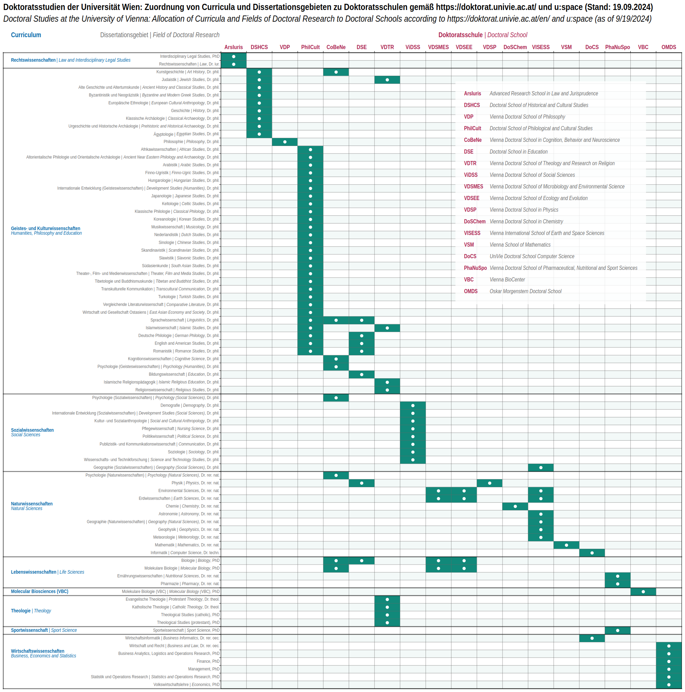

---

The University of Vienna is a large institution with a wide range of programs, initiatives, platforms, centers, hubs, etc. This abundance is sometimes so overwhelming, and many people struggle to navigate and fully understand how everything fits together. For example, I was initially very confused by the relationship between **Curriculum**, **Dissertationsgebiet** ("Field of Doctoral Research"), and **Doktoratschule** ("Doctoral School") at UniVie while preparing my PhD application. I suspect many other PhD students experience the same confusion.

After receiving contradictory information from different sources for a couple of months, I decided to sit down and sort everything out. I created a [PDF (80 KB)](Doctoral_Studies_20240919.pdf) to summarize what I had learned. I shared 
this table with Katja, the coordinator of my **Doktoratschule**, and she was delighted :D Apparently, this topic is 
notoriously complex, and no such clear overview had existed until now.

---

- The **Curriculum** can be seen as a generic academic framework or template. Each **Curriculum** corresponds to a 
set of **Dissertationsgebiete**, which are similar to majors or subject areas. For example, "Cognitive Science" and "Art History" are two different **Dissertationsgebiete** that both fall under the **Curriculum** of "Humanities, Philosophy, and Education" at UniVie.

- However, at the PhD level, somewhat counterintuitively, it is the **Curriculum**, not the **Dissertationsgebiet**,
  that defines the required modules, ECTS credits, and other formal requirements of the PhD program. This means that a PhD student in Cognitive Science follows the exact same **Curriculum** as one in Art History. This is a major source of confusion.

- The mapping between **Curricula** and **Dissertationsgebiete** is defined by university regulations and is not 
arbitrary. When applying for PhD admission via u\:space, applicants must formally select a **Dissertationsgebiet**, 
  which also determines their **Curriculum**.

- The **Doktoratschulen**, on the other hand, are a more recent development. They are informal in terms of admissions 
and are completely independent of the official PhD admission process through u\:space. Their role is to serve as 
  (mandatory) support structures for PhD students, providing a scholarly community that includes fellow 
  students, mid-level academics, and professors. Notably, as far as I know, there is hardly any formal community for PhD students who share the same **Dissertationsgebiet** or the same **Curriculum**. At UniVie, community and peer interaction primarily come through your **Doktoratschule**.

- The relationship between **Dissertationsgebiete** and **Doktoratschulen** is somewhat complex: almost all **Doktoratschulen** are associated with multiple **Dissertationsgebiete**, and some 
**Dissertationsgebiete** are associated with multiple **Doktoratschulen**. In such cases, you can choose which one to join, often based on your research interests, your supervisor's recommendation, or the choices of your colleagues. For example, PhD students in "Linguistics" as their **Dissertationsgebiet** can choose among 3 different **Doktoratschulen**.
